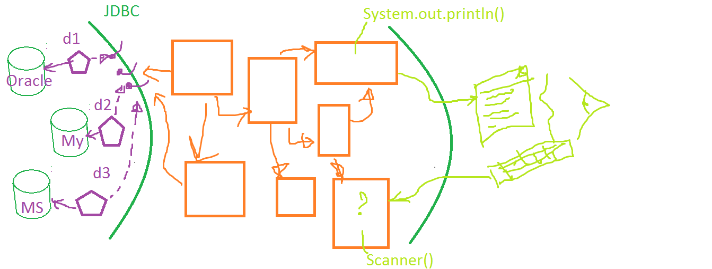

 * ## ООП

    + **Абстракция** — это модель некоего объекта или явления
реального мира, откидывающая незначительные детали, не
играющие существенной роли в данном контексте.

    + **Инкапсуляция** — это способность объектов скрывать часть
   своего состояния и поведения от других объектов,
   предоставляя внешнему миру только определённый
   интерфейс взаимодействия с собой.
   
    + **Наследование** — это возможность создание новых классов
на основе существующих. Главная польза от наследования
— повторное использование существующего кода.

    + **Полиморфизм** — это способность программы выбирать
   различные реализации, при вызове операций с одним и
   тем же названием.
   
* ## Отношения между объектами

    + **Ассоциация** — это когда один объект использует другой,
        либо зависит от него.
        
    + **Композиция** — это отношение «часть-целое» между двумя
        объектами, когда один из них включает в себя другой.
        Особенность этого отношения заключается в том, что
        компонент может существовать только как часть
        контейнера. 
        
    + **Агрегация** — это менее строгий вариант композиции, когда
        один объект просто имеет ссылку на другой объект. Здесь
        контейнер не управляет жизненным циклом компонента.
        Компонент может существовать отдельно от контейнера.  
        
* ## Паттерны проектирования

    + **Порождающие паттерны** беспокоятся о гибком создании
        объектов без внесения в программу лишних зависимостей.
        
    + **Структурные паттерны** показывают различные способы
        построения связей между объектами.
        
    + **Поведенческие паттерны** заботятся об эффективной
        коммуникации между объектами.  
        
* ## Паттерн Стратегия
   
    + **Паттерн Стратегия** определяет семейство алгоритмов, 
    инкапсулирует каждый из них и обеспечивает их взаимозаменяемость.
    Он позволяет модифицировать алгоритмы независимо от их использования
    на стороне клиента.
    
* ## Паттерн Наблюдатель
    + **Паттерн Наблюдатель** определяет отношение "один-ко-многим" между 
    объектами таким образом, что при изменении состояния одного объекта 
    происходит автоматическое оповещение и обновление всех зависимых объектов.    
        
        __________________________________________________________
        
* ## Техническое задание на проект SQLCmd
        
        
        
   + **Задача - написание приложения на языке Java, реализующего функционал консольного клиента для работы с конкретной базой данных. Проект должен отвечать следующим требованиям:**
        
        + Приложение должно использовать паттерн MVC (https://youtu.be/7Vo0bGL2AGs?t=483)
        + Приложение должно иметь консольный интерфейс взаимодействия с пользователем, то есть реализован ввод команд с клавиатуры и вывод результатов на экран.
        + Должны быть реализованы следующие консольные команды:
        + сonnect        
          + Команда для подключения к соответствующей БД
          + Формат команды: connect | database | username | password
               + где: database - имя БД
               + username -  имя пользователя БД
               + password - пароль пользователя БД
          + Формат вывода: текстовое сообщение с результатом выполнения операции
        + tables
          + Команда выводит список всех таблиц
          + Формат: tables (без параметров)
          + Формат вывода:
               + в любом удобном формате
               + например **[table1, table2, table3]**
        + clear
          + Команда очищает содержимое указанной (всей) таблицы
          + Формат: clear | tableName
               + где tableName - имя очищаемой таблицы
          + Формат вывода: текстовое сообщение с результатом выполнения операции
        + drop
          + Команда удаляет заданную таблицу
          + Формат: drop | tableName
               + где tableName - имя удаляемой таблицы
          + Формат вывода: текстовое сообщение с результатом выполнения операции
        + create
          + Команда создает новую таблицу с заданными полями
          + Формат: create | tableName | column1 | column2 | ... | columnN
               + где: tableName - имя таблицы
               + column1 - имя первого столбца записи
               + column2 - имя второго столбца записи
               + columnN - имя n-го столбца записи
          + Формат вывода: текстовое сообщение с результатом выполнения операции
        + find 
          + Команда для получения содержимого указанной таблицы
          + Формат: find | tableName
               + где tableName - имя таблицы
          + Формат вывода: табличка в консольном формате
          
         | ------ | ------- |-------- |
         |  col1  |  col2   | col3    |
         |  123   |  stiven | pupkin  |
         |  345   |  eva    | pupkina |
        
        + insert
          + Команда для вставки одной строки в заданную таблицу
          + Формат: insert | tableName | column1 | value1 | column2 | value2 | ... | columnN | valueN
               + где: tableName - имя таблицы
               + column1 - имя первого столбца записи
               + value1 - значение первого столбца записи
               + column2 - имя второго столбца записи
               + value2 - значение второго столбца записи
               + columnN - имя n-го столбца записи
               + valueN - значение n-го столбца записи
          + Формат вывода: текстовое сообщение с результатом выполнения операции
        + update
          + Команда обновит запись, установив значение column2 = value2, для которой соблюдается условие column1 = value1
          + Формат: update | tableName | column1 | value1 | column2 | value2
               + где: tableName - имя таблицы
               + column1 - имя столбца записи которое проверяется
               + value1 - значение которому должен соответствовать столбец column1 для обновляемой записи
               + column2 - имя обновляемого столбца записи
               + value2 - значение обновляемого столбца записи
               + columnN - имя n-го обновляемого столбца записи
               + valueN - значение n-го обновляемого столбца записи
          + Формат вывода: табличный, как при find со старыми значениями обновленных записей.
        + delete
          + Команда удаляет одну или несколько записей для которых соблюдается условие column = value
          + Формат: delete | tableName | column | value
               + где: tableName - имя таблицы
               + Column - имя столбца записи которое проверяется
               + value - значение которому должен соответствовать столбец column1 для удаляемой записи
          + Формат вывода: табличный, как при find со старыми значениями удаляемых записей.
        + help 
          + Команда выводит в консоль список всех доступных команд
          + Формат: help (без параметров)
          + Формат вывода: текст, описания команд с любым форматированием
        + exit 
          + Команда для отключения от БД и выход из приложения
          + Формат: exit (без параметров)
          + Формат вывода: текстовое сообщение с результатом выполнения операции
        
        + Все задачи должны быть описаны с использованием подхода User Stories + Use Cases и размещаться в корне приложения в файле README.MD
        
        + Формат:
        
        + **Userstories** - Я как РОЛЬ хочу чтобы ВЕЛЬЮ для того, чтобы ЦЕННОСТЬ, где:         
        
          * **РОЛЬ** - это тот тип пользователя, который будет пользоваться приложением
        
          * **ВЕЛЬЮ (VALUE)** - это кусочек функциональности, часть приложения, которую предстоит разработать для данного типа пользователей
        
          * **ЦЕННОСТЬ** - это то зачем этому типу пользователей данный функционал, какую проблему данный тип пользователей будет с его помощью решать.
        + Пример:
        
          + 6u **[Подключение к базе]** Я как ЮЗЕР хочу подключиться к существующей базе данных и вносить в нее правки
        
          + 6u.1 **[успешно подключились]** я вижу приветствие от программы -> я ввожу имя базы, юзер, пароль -> я вижу сообщение что все ок (подключение успешно) -> PROFIT
          + 6u.2 **[неправильный пароль]** я вижу приветствие от программы -> я ввожу имя базы, юзер, пароль (не верный) -> я вижу сообщение, что пароль не правильный -> я вижу поле для повторного ввода пароля -> я ввожу его (правильный) -> подключение успешно -> ПРОФИТ
          + 6u.3 **[несуществующая база]** приветствие -> ввожу имя несуществующей базы c какими-то логином и паролем -> вижу что базы не существует -> повторное поле ввода -> ввожу все правильно -> подключился
          + 6u.4 **[несуществующий пользователь]**
          + 6u.5 ...
        + 4r **[Список таблиц]** Я как ЮЗЕР хочу, чтобы у меня было видно список всех таблиц, для того, чтобы иметь возможность с ними работать
        
          + 4r.1 **[Вывод таблиц]** Вижу поле для ввода -> Ввожу команду "list" -> вижу список таблиц в формате "[tableName1, tableName2, tableName3]"
          + 4r.2 **[Ошибочная команда]** Вижу поле для ввода -> Ввожу неправильную команду "lisBUGt" -> вижу сообщение об ошибке, что такой команды не существует -> вижу поле для ввода
          + 4r.3 [] ...
        + 3e **[Содержимое таблицы]** Я как ЮЗЕР хочу, иметь возможность просмотреть содержимое таблицы перед правкой.
        
          + 3e.1 **[Вывод содержимого таблицы]** Вижу поле для ввода -> Ввожу команду "find tableName1" -> вижу список всех данных таблицы, в формате текстовой таблички -> вижу поле для ввода команды
          + 3e.1 **[Таблицы не существует]** Вижу поле для ввода -> Ввожу команду "find NOTEXISTStable" -> вижу сообщение о том, что таблицы не найдено -> вижу список всех таблиц -> вижу поле для ввода команды
          + 3e.1 **[Вывод части таблицы]** Вижу поле для ввода -> Ввожу команду "find tableName1 LIMIT OFFSET" -> вижу список записей этой странички, в формате текстовой таблички -> вижу поле для ввода команды
          + 3e.1 **[Ошибка в LIMIT/OFFSET]** ...
          + 3e.1 [] …
        + 6m **[Изменение таблицы]** Я как ЮЗЕР хочу иметь возможность править конкретную запись в таблице
        
          + 6m.1 [] ...
        + 9d **[Запуск query]** Я как ЮЗЕР хочу иметь возможность выполнять соответствующие QUERY для того, чтобы проверять их или выбирать конкретные значения.
        
          + 9d.1 [] ...
          + 8a [] ...
        
_______________________________________________________________________________________________________________________________________________________________________________________________________________________________

   **Архитектура приложения**

   + Основана на шаблоне MVC. Model служит для инкапсуляции алгоритма общения с базой данных посредством JDBC. Controller, базируясь на шаблоне Command инкапсулирует отдельные команды с одной стороны, а с другой стороны - взаимодействие Model и View. View в свою очередь примитивно заботится о выводе из консоли и вводе через консоль.

   + Для простоты можно считать, что тип всех полей всех табличек - String (в том числе id).

   + Точкой входа в приложение Main class который и запускается через консоль.  
   
   
   
   + В процессе стоит обратить внимание на:
     + Зачем придумали реляционную модель баз данных, какие основные принципы и ключевые моменты в них есть. Википедия и гугл в помощь! Развивайте навык поиска информации в сети. Используйте статьи на английском языке для этого - это важно!
     + Узнать про нормализацию данных в реляционных базах и различные нормальные формы, а также зачем они придуманы.
     + Узнать про основные типы SQL запросов (CRUD): INSERT, UPDATE, SELECT, DELETE
     + Узнать про JDBC интерфейс в java как способ подключаться к любой базе данных (при условии что есть драйвер - jar-библиотека подключенная к проекту, с реализацией JDBC адаптера к базе)
     + Установить на компьютере PostgreSQL сервер и клиент.
     + Создать таблицу users и добавить несколько записей, желательно уметь то же делать через SQL
     + Научиться получать ввод пользователя через объект класса Scanner (или другими средствами)
     + Подготовить массу вопросов на эту тему и задать их коллегам в Slack чате. Обсуждение это важный инструмент каждого java developer’а.
   
   + В приложении обязательна обработка исключительных ситуаций, с выводом соответствующей информации об ошибках на экран в виде, понятном пользователю.
   
   
   + Приложение обязательно должно быть покрыто юнит-тестами и интеграционными тестами и должно их успешно проходить после чекаута проекта из репозитория.
   
   
   + При разработке приложения рекомендуется использовать следующие инструменты (Важно! Это стоит делать не сразу, но на протяжении оставшейся части JuJa Core тренинга параллельно с проработкой LMS и их тем).
   
     + API JDBC для доступа к БД
     + База данных: PostgreSQL
     + Система контроля версий: GIT
     + Фреймворки тестирования: JUnit, Mockito
     + Система сборки приложения: Maven
   
   При разработке приложения приветствуются дополнения по расширению функционала (команд), не нарушающие основные требования к проекту (список команд описан выше). Также можно использовать и другие технологии, не сильно перегружающие архитектуру.
   
   
   **План выполнения проекта**
   
   
   + Проект выполняется в рамках учебного процесса курса Java Core и по мере изучения материала в проект добавляется соответствующий функционал. Выполнение проекта начинается, когда студент достигает седьмого модуля. В рамках курса представлен подробный разбор и реализация конкретных задач, а также пример кода.
   
   + Не стоит вслепую копировать код из проекта-примера, а следовать следующему алгоритму-рекомендации. Прочитав эту документацию приступить к реализации. Начинать можно с main класса в котором с помощью JDBC вытянуть любую запись из любой таблицы любой базы (просто “захардкодить”). Параллельно изучить первые 10-15-20 минут видео до момента, когда захочется попробовать реализовать следующий шаг - проработка архитектуры MVC. Если есть вопросы - обращаемся к следующим 15-20 минутам видео, либо формулируем вопрос в Slack-чате (https://jujacore.slack.com/messages/week07-sqlcmd/). Также есть возможность скачать исходники и посмотреть как было реализовано то, над чем работал тренер в Видео.
   
   
   **Седьмой модуль.**
   
   + Знакомство с техническим заданием, архитектурой приложения SQLCmd.
   + Создание нового проекта, система сборки - maven.
   + Реализация подключения к БД PostgreSQL при помощи API JDBC, слоя DataManager. Реализация юнит-тестов.
   + Реализация в приложении паттерна MVC.
   + К окончанию седьмого модуля: в приложении реализован паттерн MVC, приложение подключается к БД, реализует простейшие user-stories (подключение к БД). Приложение частично покрыто юнит-тестами и успешно проходит их. Проведено несколько code review разрабатываемого проекта ребятами из сообщества (ты мне) и проектов ребят (я тебе).
   
   
   **Восьмой модуль.**
   
   + Реализация в приложении шаблона Команда. Реализация интеграционных тестов.
   + Реализация в приложении обработчиков исключительных ситуаций.
   + Создание репозитория на github, теперь все изменения только через git.
   + Использование фреймворка Mockito.
   + Доработка нереализованных команд до 60%
   + К окончанию модуля в проекте реализованы интеграционные тесты, добавлена обработка исключительных ситуаций, разработка ведется с использованием системы контроля версий, все изменения коммитятся на github. Приложение полность покрыто Unit тестами, code coverage доведен до 90%. Проведено несколько code review разрабатываемого проекта ребятами из сообщества (ты мне) и проектов ребят (я тебе).  Устранено все дублирование, magic numbers а переменным, методам и классам даны читабельные имена. Форматирование проекта стандартное, Java Code conventions соблюдены полностью. По User Stories готовность 60%
   
   
   **Девятый модуль.**
   
   + Переводим SqlCMD на Collections Framework
   + Рефакторинг опирающийся на Юнит тесты.
   + Доработка нереализованных команд до 100%
   + К окончанию модуля в проекте не должно оставаться ни одного массива, на которые мы опирались раньше. Стоит рассмотреть различные реализации которые проходим в LMS и воспользоваться ими. При этом не стоит переписывать все с нуля, а стоит пользоваться подходами Рефакторинга и опираясь на Unit тесты системы постепенно переводить архитектуру на новый лад.
   
   
   **Десятый модуль**
   
   + Защита SQLCmd проекта
   
   + Ближе к завершению первой части тренинга JujaCore, необходимо финализировать проект с последующей его защитой. Процедура сейчас такая:
   
     + реализовать проект SqlCmd (все команды, полноценное приложение)
     + пройти более чем 70% заданий в LMS
     + (опционально) участвовать в турнирах codenjoy
     + (опционально) работать в парах и участвовать в хакатонах
     + пройти со своим SQLCmd проектом ряд кодревью у комьюнити по правилам указанным вот тут http://bit.ly/juja-56AD   
       + в первую очередь ревью делаются тем, кто имеет минимальный баланс (долг)
       + чтобы понизить баланс надо делать ревью другим проектам-участникам
       + если записано видео то из расчета - один раз ты, один раз тебе
       + если видео не пишется, то из расчета - три раза ты, один раз тебе
     + Финальное ревью должен сделать кто-то более опытный (тот, кто прошел SQLCmd проект, сам делал в прошлом ревью и ему делали). Иначе есть шанс, что результат будет требовать существенных доработок.
     + Почему так? Во первых, система будет работать если "зайчиков", тех кто хочет "не заморачиваться и сделать все по быстрому" будут единицы, потому за одно ревью тебе ты должен сделать 2-3 ревью сам. Во вторых если все обойдется одним только ревью, и результат будет “такой себе”. На реальных проектах порой два три раза каждый свой коммит переделываешь (это если повезет попасть на такой проект, где без кодревью никак нельзя, и ревьювать будет более опытный дотошный коллега, как например Дядя Боб). Потому ревью должно быть много! Это как почистить зубы каждый день, вынести мусор, помыть посуду, убраться в квартире, подмести пол, слить в туалете после себя…
   + Запись демо-видео от автора того как устроен проект изнутри и как он выглядит снаружи (~15 минут)
   + Оплата второй части (если оплата была частями)
   + Получение доступа к второй части JujaHardCore тренинга
   
   **Часто задаваемые вопросы:**
   
   + Q: А в кредит можно сделать финальное ревью? A то у меня не отрицательный баланс, а кодревью сделать надо
   
   
   + A: Ты хочешь в обход системы, это похвально что ищешь варианты как предприниматель. Молодец! Но в данном случае скажу “нет”, и поясню - если раз сделаем исключение, другой кто-то спросит "а почему мне так нельзя?" и будет прав, если так сделает каждый второй или даже третий - система рухнет. Что ты можешь сейчас сделать - так это попросить кого-нибудь покодревьювать тебе из комьюнити, уверен такие ребята с удовольствием найдутся.А когда будет отрицательное число, тогда с удовольствием сделаю или я или кто-то из тех, кто уже прошел SQLCmd и проходит ЕЕ (если вдруг буду занят а ты не сможешь ждать).
   
   
   + Q: Как часто нужно проводить ревью прокта?
   
   + A: Многие думают - я должен сделать полностью работающую многофункциональную программу, покрытую всеми видами тестов, с описанным JavaDoc, Readme и т.д. И отдать на тестирование. Ревью это не тестирование. Чтобы нормально отревьюить работающую полную SQLCMD нужен день или более. На ревью можно и нужно отдавать каждый класс, даже не работающий, даже без тестов. Потому что ревьюер может найти ошибки наименования переменных, алгоритмов, лишние импорты, и т.д. Может ревьювер вчера прочитал последнюю книжку по каким нить паттернам, и ревьюя код - подскажет лучшее решение вместо цикла)). Ревьюер это не тестировщик работающего приложения)). Поэтому - как можно чаще делайте ревью друг у друга. Ревью это советы. Можно к ним прислушаться - можно нет, если есть свое мнение или понимание. На самом деле можно делать ревью даже не всего проекта, а например класса, модуля, функционала. Бывает sql cmd - небольшой, но ошибок очень много, бывают проекты гигантские с кучей функционала, и при ревью такого проекта два варианта - либо записывать 3-4 часа, либо пропускать все, а останавливаться только на тестировании функционала - что не верно. Так что как можно чаще отдавайте свои проекты на ревью.